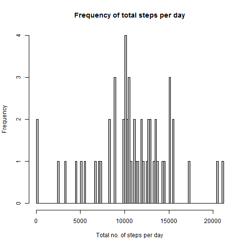
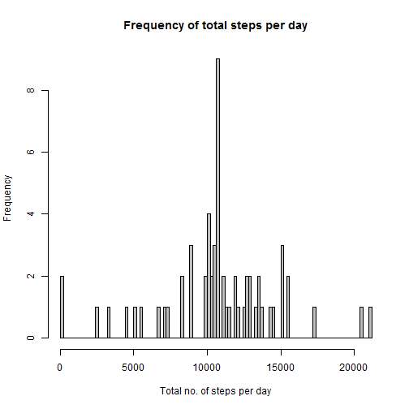
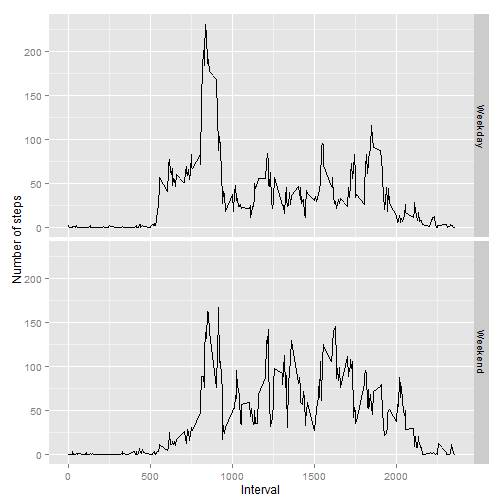

## Loading and preprocessing the data
This assignment makes use of data from a personal activity monitoring
device. This device collects data at 5 minute intervals through out the
day. The data consists of two months of data from an anonymous
individual collected during the months of October and November, 2012
and include the number of steps taken in 5 minute intervals each day.

```r
activityData <- read.csv("activity.csv")
```


## What is mean total number of steps taken per day?
Compute the sum of steps taken for each day.

```r
sumDate <- aggregate(activityData[, 1], list(activityData$date), sum)
colnames(sumDate) <- c("date", "totalSteps")
```

The histogram shows the frequency of total number of steps taken per day.

```r
hist(sumDate$totalSteps, breaks = 100, 
     main = "Frequency of total steps per day", 
     xlab = "Total no. of steps per day", col = "gray")
```

 

The Mean and Median values of the total number of steps taken per day are:

```r
mean(sumDate$totalSteps, na.rm = TRUE)
```

```
## [1] 10766.19
```

```r
median(sumDate$totalSteps, na.rm = TRUE)
```

```
## [1] 10765
```


## What is the average daily activity pattern?
Averaging interval wise step count

```r
avgInterval <- aggregate(activityData[, 1], list(activityData$interval), mean, 
                         na.rm = TRUE)
colnames(avgInterval) <- c("interval", "meanSteps")
```

Time series plot of the average number of steps taken in the 5-minute intervals.

```r
plot(avgInterval$meanSteps ~ avgInterval$interval, type = "l", 
     xlab = "Interval", ylab = "Average number of Steps")
```

 
This shows the activity is between 5:00 and 20:00 hours, peaking between 8:00 and 10:00 hours.

Let us find Which 5-minute interval contains the maximum number of steps.

```r
library(dplyr)
select(head(arrange(avgInterval, desc(meanSteps)), 1), c(interval, meanSteps))
```

```
##   interval meanSteps
## 1      835  206.1698
```


## Imputing missing values
Calculate how many values are missing in the data set.

```r
nrow(activityData[!complete.cases(activityData), ])
```

```
## [1] 2304
```

Impute missing values with the average number of steps for that interval.
- As seen from the earlier plot, the activity varies throughout the day. So we are considering here to take the average number of steps for that interval for imputing.

```r
imputedData <- merge(x = activityData, y = avgInterval, 
        x.by = activityData$interval, y.by = avgInterval$interval)
imputedData[is.na(imputedData$steps), 2] <- 
                            imputedData[is.na(imputedData$steps), 4]
imputedData <- select(imputedData, -meanSteps)
imputedData <- arrange(imputedData, date, interval)
```

Compute the total day wise step count with imputed data.

```r
sumImputed <- aggregate(imputedData[, 2], list(imputedData$date), sum)
colnames(sumImputed) <- c("date", "totalSteps")
```

Histogram of total number of steps taken each day with imputed values:

```r
hist(sumImputed$totalSteps, breaks = 100, 
     main = "Frequency of total steps per day", 
     xlab = "Total no. of steps per day", col = "gray")
```

 

Mean and Median of the total number of steps taken per day with imputed values are:

```r
mean(sumImputed$totalSteps)
```

```
## [1] 10766.19
```

```r
median(sumImputed$totalSteps)
```

```
## [1] 10766.19
```

Let us compare the values of source data and imputed data.

```r
data.frame(Data = c("Source", "Imputed"), 
           Mean = c(mean(sumDate$totalSteps, na.rm = TRUE), 
                    mean(sumImputed$totalSteps)), 
           Median = c(median(sumDate$totalSteps, na.rm = TRUE), 
                      median(sumImputed$totalSteps)))
```

```
##      Data     Mean   Median
## 1  Source 10766.19 10765.00
## 2 Imputed 10766.19 10766.19
```


## Are there differences in activity patterns between weekdays and weekends?
Create new factor variable indicating if it is a weekday or weekend.

```r
day <- data.frame(day = c("Monday", "Tuesday", "Wednesday", "Thursday", 
                          "Friday", "Saturday", "Sunday"), 
                  type = c("Weekday", "Weekday", "Weekday", "Weekday", 
                           "Weekday", "Weekend", "Weekend"))
imputedData <- mutate(imputedData, day = weekdays(strptime(imputedData$date, 
                                                        format = "%Y-%m-%d")))
imputedData <- merge(x = imputedData, y = day, x.by = imputedData$day, 
                     y.by = day$day)
imputedData <- arrange(imputedData, date, interval)
```

Calculate average number of steps per interval with imputed values.

```r
meanImputed <- aggregate(imputedData[, 3], 
                         list(imputedData$type, imputedData$interval), mean)
colnames(meanImputed) = c("Type", "interval", "meanSteps")
```

Plot the average number of steps per interval with imputed values, for weekdays and weekends.

```r
library(ggplot2)
p <- ggplot(meanImputed, aes(x = interval, y = meanSteps))
p <- p + geom_line()
p <- p + facet_grid(Type ~ .)
p <- p + labs(x = "Interval", y = "Number of steps")
print(p)
```

 
